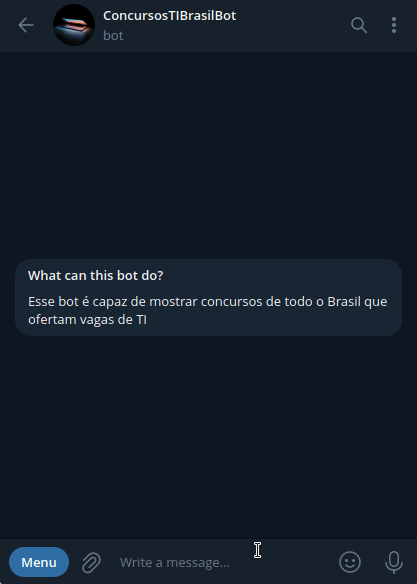

# Concursos TI Brasil Bot


## 📖 Descrição



A ideia por trás do bot é extrair concursos de todo o país que ofertam vagas de TI. Como fonte de referência esse bot utiliza o site [PCI Concursos](https://www.pciconcursos.com.br/). A necessidade que o bot satisfaz é a de obter informações de concursos de TI ocorrendo nesse exato momento.

## 📁 Estrutura de arquivos

- ```main.py```: arquivo principal do projeto contém todas as funções de funcionamento do bot (funções da API do Telegram e de scraping);

- ```pci_ti.py```: arquivo que contém a função de scraping e algumas funções auxiliares;

<!-- - ```/test```: diretório que contém testes unitários para funções auxiliares ao scraping; -->

## 🛠️ Funcionalidades

- Extração de vagas de analista de tecnologia por meio do comando ```/vagasanalista```;
- Extração de vagas de professor de informática/TI por meio do comando ```/vagasprofessor```;
- Extração de vagas de técnico de informática/TI por meio do comando ```/vagastecnico```;


## 📡 Tecnologias utilizadas

<div align="center"> 

  
</div>
<br/><br/>

## ⏳ Inicialização

Esse projeto foi inspirado pelo projeto [PCI concursos](https://github.com/luiseduardobr1/PCIConcursos) do [Luis Eduardo Pompeu](https://github.com/luiseduardobr1). Ele foi desenvolvido usando a linguagem de programação [Python](https://www.python.org/) usando as bibliotecas [BeautifulSoup](https://www.crummy.com/software/BeautifulSoup/) para scraping dos dados dos sites de notícias e a [pyTelegramBotAPI](https://pypi.org/project/pyTelegramBotAPI/) para execução do bot do Telegram.

<!-- O projeto usa testes unitários para garantir a confiabilidade dos dados das notícias por meio das bibliotecas [unittest](https://docs.python.org/3/library/unittest.html) e [validators](https://pypi.org/project/validators/). Além disso, o projeto utiliza um cache TTL (Time to Live) da biblioteca [cachetools](https://pypi.org/project/cachetools/) simples para manter notícias recentes guardadas em memória, evitando assim um consumo excessivo de recursos de rede no servidor onde o bot está executando. -->

<br/>

## 🤵🤵‍♀️ Colaboradores

No momento, o único colaborador desse projeto sou eu (Eduardo Vítor).

<br/>

## 🔎 Status do Projeto


<br/>

## 📑 Referências

[Python](https://www.python.org/)

[pyTelegramBotAPI](https://pypi.org/project/pyTelegramBotAPI/)

[BeautifulSoup](https://www.crummy.com/software/BeautifulSoup/)

<!-- [unittest](https://docs.python.org/3/library/unittest.html) -->

[validators](https://pypi.org/project/validators/)

<!-- [cachetools](https://pypi.org/project/cachetools/) -->

[PCI Concursos](https://www.pciconcursos.com.br/)
